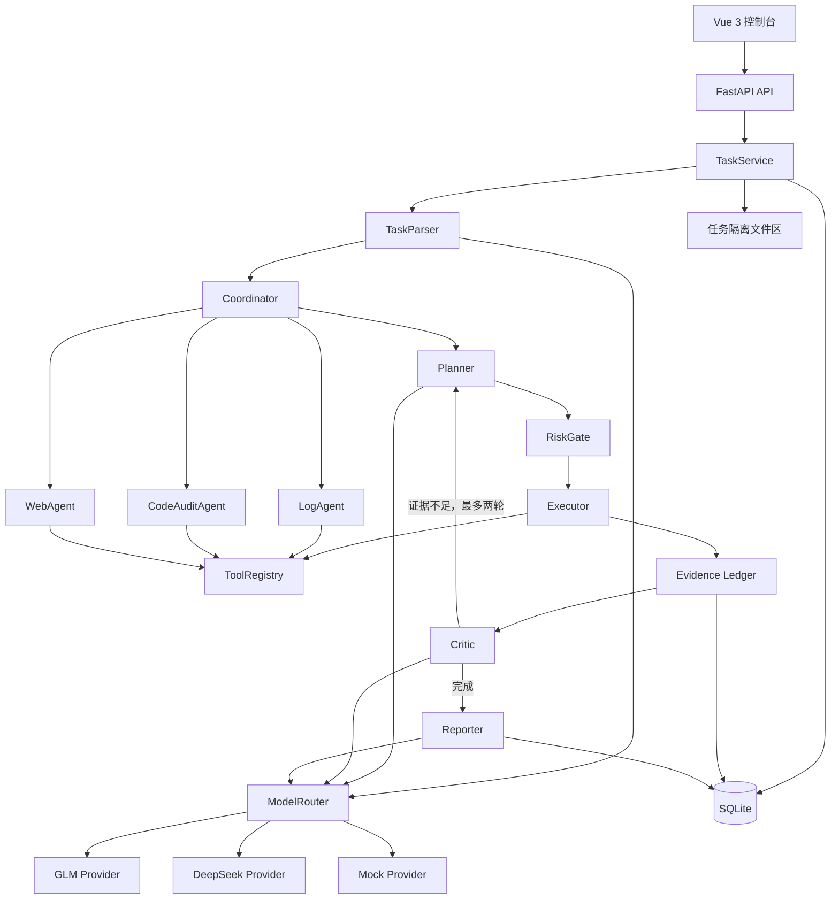

# SecAgent-X 最小可运行版本设计规格

- 状态：已批准
- 日期：2026-08-10
- 目标版本：MVP
- 项目目录：`F:\codex\secagent-x`

## 1. 背景与目标

本项目面向“具备自主决策能力的通用网络安全智能体”赛题。MVP 需要以可运行系统证明以下能力：

1. 理解中文安全任务和结构化/文件输入；
2. 在日志应急、源码审计和 Web 被动分析三个场景中生成并执行计划；
3. 根据阶段特点协同使用 DeepSeek 与智谱 GLM；
4. 通过插件化工具完成确定性分析；
5. 记录模型路由、计划、工具调用、证据和决策理由；
6. 在安全边界内形成可复核、可重试、可报告的闭环。

项目采用“三场景纵向闭环”路线：先让三个场景都完成任务解析、计划、工具、证据、复核和报告，再加深单场景能力。

## 2. 范围

### 2.1 MVP 包含

- Vue 3 Web 控制台；
- FastAPI 后端与 SQLite 持久化；
- TaskParser、Coordinator、Planner、Executor、Critic、Reporter；
- DeepSeek、GLM 和 Mock 三个模型 Provider；
- 自动模型路由与阶段级人工覆盖；
- LogAgent、CodeAuditAgent、WebAgent；
- 统一 ToolRegistry 与受控工具执行；
- Evidence Ledger 证据账本；
- 风险分级、人工确认和禁止动作拦截；
- Markdown 报告；
- Windows 本地开发和 Linux Docker Compose 一键部署；
- 三个固定 Demo 数据集及自动化测试。

### 2.2 MVP 不包含

- GPT 接入；
- 自动漏洞利用、爆破、端口扫描、提权、持久化或横向移动；
- 上传源码的动态执行；
- Redis、Celery、Kafka、OpenSearch 等分布式组件；
- 账号、权限、多租户和组织管理；
- 本地大模型部署或 GPU 依赖；
- PDF 报告、移动端和复杂运营大屏。

## 3. 技术栈

| 层级 | 选型 |
|---|---|
| 前端 | Vue 3、TypeScript、Vite、Element Plus |
| 后端 | Python、FastAPI、Pydantic、SQLAlchemy |
| 数据库 | SQLite |
| 测试 | pytest、Vitest、Playwright |
| 模型 | DeepSeek API、智谱 GLM API、Mock Provider |
| 部署 | Docker Compose，Linux/CPU 环境 |
| 报告 | Markdown |

API Key 仅从环境变量读取，不写入数据库、前端响应、日志或报告。

## 4. 总体架构



LLM 只负责理解、规划、推理和表达。所有确定性分析由注册工具执行；Executor 不执行模型自由生成的命令。

## 5. 核心组件

### 5.1 TaskService

负责创建、查询、启动、暂停、取消和重试任务；保存授权声明、上传文件元数据和路由模式；为每个任务创建独立工作目录。

### 5.2 TaskParser

将自然语言和上传材料摘要转换为结构化任务：

- `scene`：`incident_response`、`source_audit` 或 `web_analysis`；
- `goal`；
- `inputs`；
- `constraints`；
- `authorization_scope`；
- `risk_level`；
- `expected_outputs`。

默认由 GLM 处理中文任务。输出必须通过 Pydantic 校验，不能直接信任模型文本。

### 5.3 ModelRouter

支持两种路由模式：

- `auto`：系统根据阶段和模型状态自动选择；
- `manual`：用户可为某阶段指定 DeepSeek 或 GLM。

默认策略：

| 阶段 | 首选模型 | 理由 |
|---|---|---|
| 中文任务理解、场景分类 | GLM | 中文理解和结构化表达 |
| 执行计划、技术推理 | DeepSeek | 技术分析与代码推理 |
| 工具结果综合、Critic | DeepSeek | 证据复核与逻辑判断 |
| 中文报告、交互说明 | GLM | 中文报告组织与表达 |

每次路由必须记录模型、阶段、选择理由、输入摘要、耗时、结果状态和回退信息。

Mock Provider 用于离线测试和无 Key 演示。无可用真实模型或真实调用连续失败时，系统可切换 Mock，但任务和报告必须显著标记“演示结果”，不能与真实模型结果混淆。

`MODEL_MODE` 的行为固定如下：

- `auto`：优先真实 Provider；任务启动时无真实 Key，或所有可用真实 Provider 重试后仍失败，则自动切换 Mock，并将任务字段 `is_demo` 设为 `true`；
- `live`：只允许真实 Provider，失败后进入 `failed_retryable`，不得使用 Mock；
- `mock`：全程使用 Mock，并从任务创建起展示“演示模式”。

手动指定模型时不自动切换到另一个真实模型；指定模型失败后按 `MODEL_MODE` 决定进入 `failed_retryable` 或使用 Mock。所有 Demo 报告在标题和摘要中标记“演示结果”。

### 5.4 Coordinator 与场景 Agent

Coordinator 根据场景选择 LogAgent、CodeAuditAgent 或 WebAgent，管理状态和执行顺序。场景 Agent 只负责提供场景计划模板、允许工具集合和完成标准，不自行绕过 Executor 调用外部能力。

### 5.5 Planner

生成结构化步骤。每步包含：

- 步骤名称与目的；
- 工具名称；
- 参数来源；
- 前置依赖；
- 风险等级；
- 是否需要人工确认；
- 完成标准。

### 5.6 RiskGate

在工具执行前检查授权范围、工具风险和参数：

- `low`：自动执行；
- `medium`：展示目标、动作和影响后等待人工确认；
- `high`：MVP 不注册此类工具；
- `forbidden`：直接拒绝并写入账本。

### 5.7 Executor 与 ToolRegistry

Executor 只能按名称调用 ToolRegistry 中的实例。工具遵循统一接口并返回标准结构：

```python
class ToolResult:
    success: bool
    summary: str
    findings: list
    evidence: list
    metrics: dict
    warnings: list[str]
    error: str | None
```

每个工具声明输入 Schema、输出 Schema、适用场景、风险等级、超时和是否幂等。

### 5.8 Critic

检查：

- 当前证据是否覆盖任务目标；
- 结论是否能追溯到工具结果或原始文件位置；
- 是否存在相互矛盾的证据；
- 是否需要补充步骤。

单任务最多再规划两轮，并限制总步骤数，防止无限循环。

### 5.9 Evidence Ledger 与 Reporter

Evidence Ledger 记录模型路由、步骤理由、工具调用、原始位置、证据摘要、置信度、错误和下一步。Reporter 只基于账本生成报告，不允许补充账本中不存在的事实。

报告结构：任务概述、授权范围、模型路由、执行计划、工具调用、关键发现、证据链、风险评级、处置建议、失败与不确定性说明。

## 6. 任务状态与主流程

任务状态：

`created → parsed → planned → running → waiting_human → completed`

异常状态：

- `paused`：用户暂停，可从当前未完成步骤继续；
- `failed_retryable`：可从失败步骤重试；
- `failed`：不可自动恢复；
- `cancelled`：用户取消。

主流程：

1. 用户提交目标、授权范围和材料；
2. 系统校验并隔离文件；
3. TaskParser 解析任务；
4. Coordinator 选择场景 Agent；
5. Planner 生成计划；
6. RiskGate 检查每个动作；
7. Executor 调用工具；
8. Evidence Ledger 持续记录；
9. Critic 判断完成或补充计划；
10. Reporter 生成 Markdown 报告。

MVP 使用 FastAPI 进程内异步任务执行器，不引入外部队列。服务重启时，原 `running` 任务改为 `failed_retryable`。

## 7. 三场景能力

### 7.1 日志应急分析

工具链：

`log_type_detector → log_analyzer → attack_pattern_detector → timeline_builder`

首版支持常见 Nginx、Apache access log，统计 IP、路径、状态码和频率，识别扫描、敏感路径访问、爆破及常见注入特征。每项发现保留原始日志行号、规则编号、判断原因和置信度。

### 7.2 源码安全审计

工具链：

`project_detector → source_scanner → secret_scanner → config_checker`

首版支持 Python、PHP、JavaScript/TypeScript，检测危险函数、命令执行、SQL 字符串拼接、弱配置和疑似硬编码密钥。只进行静态读取，不执行上传源码。

### 7.3 Web 被动辅助分析

工具链：

`url_guard → http_fetch → header_check → form_extract`

仅访问用户明确授权的 HTTP/HTTPS 地址，提取标题、链接、响应头、表单和参数，给出后续人工测试建议。首版不提交表单、不执行 Payload、不进行目录扫描、端口扫描或漏洞利用。

## 8. 安全边界

### 8.1 文件安全

- 限制上传文件类型、单文件大小、总大小和文件数量；
- 每个任务使用独立工作目录；
- 压缩包解压前检查绝对路径、`..` 路径穿越、符号链接和解压总量；
- 不执行上传文件；
- 清理报告和日志中的 API Key 与疑似密钥，只展示脱敏值。

### 8.2 Web 安全

- 只允许 HTTP/HTTPS；
- 解析并校验 DNS 结果，默认阻止回环、私网、链路本地和云元数据地址；
- 每次重定向后重新校验目标；
- 限制超时、重定向次数和响应体大小；
- Docker 内置 Web Demo 通过显式 `WEB_ALLOWED_HOSTS` 白名单放行，不能扩大为任意内网访问；
- 仅使用 GET/HEAD 获取公开页面，不提交表单。

### 8.3 Agent 安全

- 模型不能直接运行 shell；
- 未注册工具不能执行；
- 场景 Agent 只能使用其允许工具集合；
- 风险判断和人工确认写入 Evidence Ledger；
- 总步骤、再规划次数、模型调用次数和工具超时均有上限。

## 9. 数据模型

| 表 | 主要内容 |
|---|---|
| `tasks` | 目标、场景、路由模式、状态、授权声明 |
| `task_steps` | 计划、依赖、风险、状态、重试次数 |
| `model_calls` | 模型、阶段、路由理由、输入摘要、耗时、结果 |
| `tool_calls` | 工具、参数摘要、结构化输出、耗时、错误 |
| `evidences` | 类型、来源位置、摘要、哈希、置信度 |
| `approvals` | 风险动作、用户决定、时间和理由 |
| `reports` | Markdown 内容、版本和生成时间 |
| `uploaded_files` | 原文件名、受控路径、大小、哈希和状态 |

所有表使用任务 ID 关联。工具调用、证据和报告不保存明文 API Key。疑似密钥证据只保存脱敏值。

## 10. API 设计

| 方法与路径 | 用途 |
|---|---|
| `POST /api/tasks` | 创建任务并上传材料 |
| `POST /api/tasks/{id}/run` | 启动执行 |
| `GET /api/tasks` | 查询任务列表 |
| `GET /api/tasks/{id}` | 查询任务、步骤、证据和状态 |
| `POST /api/tasks/{id}/pause` | 在当前工具调用结束后暂停 |
| `POST /api/tasks/{id}/resume` | 从未完成步骤继续 |
| `POST /api/tasks/{id}/approve` | 确认或拒绝风险动作 |
| `POST /api/tasks/{id}/retry` | 从失败步骤重试 |
| `POST /api/tasks/{id}/cancel` | 取消任务 |
| `GET /api/tasks/{id}/report` | 获取 Markdown 报告 |
| `GET /api/models/status` | 查询 Provider 配置和健康状态 |
| `GET /api/tools` | 查询注册工具及风险等级 |
| `GET /api/health` | 服务健康检查 |

MVP 面向可信的本地或比赛环境，不实现账号和多租户鉴权。

## 11. 前端设计

### 11.1 页面

- 总览；
- 创建任务；
- 任务中心；
- 任务详情；
- 报告；
- 模型与工具状态。

### 11.2 创建任务

用户填写目标和授权范围，选择场景自动识别或手动指定，上传材料，并选择：

- 自动协同；
- DeepSeek；
- GLM；
- Mock 演示。

### 11.3 任务详情

页面以执行时间线为主，右侧并列证据账本。顶部展示场景、状态、风险、当前阶段、模型路由和证据数量。详情包含：

- 每步目的、状态和模型；
- 工具调用与结构化结果；
- 模型选择理由；
- 原始证据位置和置信度；
- 人工确认入口；
- 报告查看与导出。

响应式布局在窄屏时将证据账本移到时间线下方。

## 12. 失败处理

### 12.1 模型失败

- 超时或限流最多重试两次；
- 自动协同模式可切换另一真实模型；
- 真实模型均失败时可切换 Mock，并显著标记演示状态；
- 结构化输出校验失败时执行一次修复请求，仍失败则停止该步骤。

### 12.2 工具失败

- 捕获异常并写入 ToolResult 和账本；
- 仅对幂等工具自动重试一次；
- 超时立即终止本次调用；
- 工具失败后由 Critic 判断替代步骤或任务失败，不伪造结果。

### 12.3 服务失败

- 服务启动时扫描遗留 `running` 任务并改为 `failed_retryable`；
- 用户可从失败步骤继续；
- 报告必须包含失败步骤和未完成范围。

## 13. 测试策略

### 13.1 自动化测试

- pytest：状态机、ModelRouter、RiskGate、ToolRegistry、文件隔离和三类工具链；
- Vitest：任务创建、状态渲染、风险确认和证据展示；
- Playwright：创建任务、上传材料、执行、查看证据、生成报告；
- Provider 契约测试使用模拟 HTTP 响应；真实 Key 仅用于独立冒烟测试。

### 13.2 安全测试

- SSRF 和重定向绕过；
- 压缩包路径穿越、符号链接和解压膨胀；
- 超大文件和危险文件名；
- API Key 与密钥脱敏；
- 未授权工具和禁止动作拦截；
- 步骤、重试和再规划上限。

### 13.3 固定 Demo

- 日志 Demo：包含已知扫描、爆破和注入特征；
- 源码 Demo：包含预置危险函数、SQL 拼接、弱配置和假密钥；
- Web Demo：Docker 内置无攻击性的测试站点，用于响应头和表单分析。

## 14. MVP 验收标准

1. `docker compose up` 可在 Linux CPU 环境启动前后端和 Web Demo；
2. Windows 可进行本地开发；
3. 无模型 Key 时，Mock 模式完整跑通三个场景；
4. 配置 DeepSeek/GLM 后，自动路由调用正确模型并记录理由；
5. 三个 Demo 均完成“解析—计划—工具—证据—复核—报告”闭环；
6. 每条关键结论可追溯到工具输出或原始文件位置；
7. 风险动作不能绕过 RiskGate，禁止动作始终被拒绝；
8. 单个 Demo 在普通开发机上两分钟内完成；
9. 核心后端模块测试覆盖率不低于 80%；
10. 所有端到端关键路径通过；
11. 服务重启、模型超时和工具失败均留下可解释状态并允许重试。

## 15. 部署与配置

Docker Compose 至少包含：

- `backend`：FastAPI；
- `frontend`：构建后的 Vue 控制台；
- `web-demo`：被动分析测试站点；
- 持久化卷：SQLite、上传文件和报告。

主要环境变量：

- `DEEPSEEK_API_KEY`、`DEEPSEEK_BASE_URL`、`DEEPSEEK_MODEL`；
- `GLM_API_KEY`、`GLM_BASE_URL`、`GLM_MODEL`；
- `MODEL_MODE`：`auto`、`live` 或 `mock`；
- `WEB_ALLOWED_HOSTS`；
- 上传大小、步骤数、再规划次数和超时限制。

系统不依赖本地 GPU，真实模型全部通过 API 调用。

## 16. 实施边界

本规格只定义首个可运行版本。实施计划应按可独立验证的纵向切片推进：先建立 Mock 模式的完整闭环，再接真实模型 Provider，然后依次接入日志、源码和 Web 工具链，最后完成前端、Docker 和比赛材料。每个切片必须有自动化测试，不在首版扩展攻击性能力或企业级基础设施。
