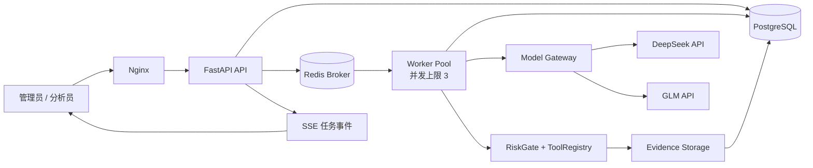

# SecAgent-X 内网团队生产版升级设计

- 状态：已批准
- 日期：2026-08-14
- 目标版本：Team Production v1
- 基线分支：`feature/secagent-x-mvp`
- 适用规模：10 人以内，最多 3 个并发安全任务

## 1. 背景与决策

现有 SecAgent-X MVP 已具备日志响应、静态源码审计和被动 Web 分析三条闭环，也包含 DeepSeek、GLM 与 Mock Provider 的基础实现。当前版本仍以单机演示为主：SQLite 持久化、API 进程内执行、无用户身份、真实模型接口缺少生产级校验和运行可观测性。

本次升级采用“渐进式生产加固”路线，保留现有安全场景、工具白名单、RiskGate 和证据账本，重点升级认证授权、可靠任务队列、PostgreSQL、真实双模型调用、故障恢复、审计与团队控制台。

已经确认的核心决策如下：

1. 部署目标是内网多用户团队版；
2. 使用本地账号、JWT 和管理员创建用户；
3. 首版支持 10 人以内、最多 3 个并发任务；
4. API 与独立 Worker 通过 Redis 队列解耦；
5. DeepSeek 与 GLM 固定分工，不互相降级替代；
6. DeepSeek 负责计划和技术复核，GLM 负责中文解析和报告；
7. 两套真实 API Key 均由部署者在本地 Secret 中配置；
8. GPT 不在本项目范围内。

## 2. 目标与非目标

### 2.1 目标

- 提供管理员和分析员两类账号与严格的资源级权限校验；
- 支持任务排队、3 路并发、Worker 心跳、异常回收和有界重试；
- 使用 PostgreSQL 作为唯一业务状态源；
- 对 DeepSeek 和 GLM 提供独立、可验证、可观测的生产 Provider；
- 生产模式中禁止静默切换模型或降级为 Mock；
- 保留全部安全边界：工具白名单、人工审批、上传隔离、SSRF 防护与证据追溯；
- 为管理员提供用户、审计、模型和 Worker 健康视图；
- 通过单元、集成、E2E、安全和真实模型冒烟测试。

### 2.2 非目标

- 公网 SaaS、多组织、多租户和企业 SSO；
- 100 人以上规模或跨节点大规模调度；
- 自动漏洞利用、爆破、提权、横向移动或其他攻击性能力；
- 执行上传源码、安装其依赖或运行不受信任命令；
- 在数据库或前端保存、展示模型明文密钥；
- 在生产任务中使用 Mock 生成安全结论；
- 首版实现任务共享、细粒度团队组或自定义角色。

## 3. 总体架构

组件职责：

- Nginx：静态前端、API 反向代理、上传大小限制和基础安全响应头；
- FastAPI：身份认证、资源授权、任务命令、查询、审批、管理和 SSE；
- PostgreSQL：用户、任务、运行状态、模型调用、工具调用、证据元数据、审批、报告和审计事件；
- Redis：Celery 任务 Broker、并发调度和短期协调数据，不作为业务事实源；
- Worker：领取任务、持有租约、执行智能体状态机并持续写入心跳；
- Model Gateway：Provider 隔离、结构化输出、重试、指标和脱敏错误；
- RiskGate/ToolRegistry：继续作为模型与外部动作之间不可绕过的安全边界；
- Evidence Storage：共享只读/读写卷中的上传材料、证据和报告文件，数据库保存哈希与引用关系。

Worker 队列实现必须隐藏在 `JobQueue` 接口后。首版采用 Celery 5.6 与 Redis Broker，而不是在业务层直接散落 Redis 命令；任务最终状态仍由 PostgreSQL 状态机决定，不使用 Celery Result Backend 保存业务结果。Worker 固定 `concurrency=3`、`worker_prefetch_multiplier=1`，任务使用晚确认；Worker 丢失后的重新入队由数据库租约回收器和有限尝试次数控制，避免 Broker 无限重投。

## 4. 身份认证与权限

### 4.1 登录与会话

- 密码使用 Argon2id 哈希，不保存可逆密码；
- 登录成功后返回短期 Access JWT，默认有效期 15 分钟；
- Access JWT 仅保存在前端内存中，不写入 `localStorage`；
- Refresh Token 使用高熵随机值，浏览器通过 `HttpOnly`、`SameSite=Strict` Cookie 持有；
- 数据库只保存 Refresh Token 哈希、到期时间、创建时间和吊销时间；
- 刷新时轮换 Token，退出登录、禁用用户或修改密码时吊销现有会话；
- JWT 签名密钥与模型密钥一样通过部署 Secret 注入。

### 4.2 角色

管理员可以：

- 创建、禁用、重置分析员账号；
- 查看全部任务、报告和审计事件；
- 查看 Worker、数据库、Redis 和模型 Provider 健康状态；
- 取消任何任务和处理任何待审批动作；
- 读取配置状态，但不能通过 API 读取明文 Secret。

分析员可以：

- 创建、执行、暂停、恢复、取消和重试自己的任务；
- 查看自己的步骤、工具调用、模型调用、证据和报告；
- 审批自己任务中的中风险动作；
- 不能访问其他分析员的任务、上传材料、证据或报告；
- 不能管理用户、系统策略或模型配置。

所有资源 API 先执行身份认证，再执行对象所有权或管理员角色校验。禁止仅依赖前端隐藏按钮实现权限。

### 4.3 初始管理员

首次部署通过一次性 CLI 命令创建管理员。命令交互式读取密码，不通过命令行参数、镜像层或 Git 文件传入。系统不得提供公开注册入口。

## 5. 任务队列与状态机

### 5.1 状态

主状态如下：

`created -> queued -> running -> waiting_human -> queued/running -> completed`

异常和人工状态如下：

- `paused`：Worker 在当前原子步骤完成后释放执行权；
- `failed_retryable`：外部模型、网络或 Worker 故障，可由用户重新排队；
- `failed`：确定性校验失败、预算耗尽或安全策略拒绝后终止；
- `cancelled`：用户取消，不再自动恢复。

### 5.2 排队与并发

- `POST /tasks/{id}/run` 只提交队列，不在 API 请求内执行任务；
- Worker Pool 总并发固定为 3，可通过环境变量下调，不允许在首版动态上调；
- 第 4 个及后续任务保持 `queued`，按进入顺序领取；
- 同一任务同一时刻只能有一个活动运行，数据库唯一约束防止重复运行；
- API 命令使用幂等键，重复点击不会重复入队或重复创建审批。

### 5.3 租约、心跳与恢复

- Worker 领取任务时创建 `job_run` 并获得有限时长租约；
- 运行期间定时更新心跳和租约；
- Worker 崩溃或失联后，回收器递增运行尝试；仍在自动恢复预算内时重新入队，达到上限时标为 `failed_retryable` 等待人工重试；
- 每个步骤拥有稳定幂等键；已成功并已记录证据哈希的步骤不会重复产生证据；
- 工具是否可以自动重试由工具元数据声明，非幂等工具不自动重试；
- 暂停与取消在步骤边界生效，不能粗暴终止正在写入的原子操作。

## 6. DeepSeek 与 GLM 固定分工

### 6.1 默认模型

截至本设计日期，生产默认值为：

- DeepSeek：`deepseek-v4-pro`；
- GLM：`glm-5.2`。

模型名称和 Base URL 必须通过环境变量覆盖，以适应服务方升级；代码不得把模型行为与某个不可替换字符串耦合。默认端点采用两家官方 OpenAI-compatible Chat Completions 接口。

### 6.2 阶段绑定

| 阶段 | Provider | 职责 |
|---|---|---|
| `TASK_PARSE` | GLM | 解析中文目标、场景、输入、授权边界和预期输出 |
| `PLAN` | DeepSeek | 生成只包含已注册工具的结构化执行计划 |
| `CRITIC` | DeepSeek | 对照证据账本复核完整性、矛盾和缺失证据 |
| `REPORT` | GLM | 仅基于已验证证据生成中文报告 |

生产模式不允许跨模型替代：DeepSeek 失败不能由 GLM 完成计划或复核，GLM 失败不能由 DeepSeek完成解析或报告。失败进入有界重试，仍失败则进入 `failed_retryable`。Mock 仅用于测试和显式 Demo 环境。

### 6.3 Provider 边界

不再用一个无差别的通用类承载全部行为，而是保留公共 HTTP 基类并增加 `DeepSeekProvider` 与 `GLMProvider` 适配器。适配器负责：

- Provider 特有的请求参数、思考模式和响应字段；
- `finish_reason`、空内容、请求 ID 和 Token Usage 解析；
- HTTP 错误分类与脱敏；
- 对 JSON Output 能力和模型名称执行启动时配置校验。

HTTP 客户端在 Worker 进程内复用连接池，不为每次调用重新创建客户端。

### 6.4 结构化输出

每个阶段拥有独立的 Pydantic 输入/输出 Schema。模型请求必须：

1. 在提示词中明确要求输出 JSON；
2. 提供目标结构和最小示例；
3. 使用 `response_format={"type":"json_object"}`；
4. 设置阶段级 `max_tokens`、超时和调用预算；
5. 校验 HTTP 状态、非空内容、`finish_reason`、JSON 语法和业务字段；
6. 拒绝未知工具、越权参数、额外高风险动作和未引用证据的报告结论。

结构校验失败时，只允许同一 Provider 执行一次“根据校验错误修复 JSON”的请求。修复仍失败则停止当前阶段，不猜测缺失字段。

### 6.5 思考内容

DeepSeek 可在计划和复核阶段启用思考模式，但系统只持久化最终结构化结果、选择理由摘要和可验证证据引用。不得向前端展示或在数据库中持久化 Provider 返回的内部推理文本。

## 7. 模型错误恢复与预算

可重试错误：网络中断、连接超时、HTTP 429、HTTP 5xx 和服务方资源不足。不可重试错误：401/403、无效请求、未知模型、确定性 Schema 冲突或安全校验拒绝。

恢复规则：

- 遵循服务方 `Retry-After`；否则采用带抖动的指数退避；
- 单次模型调用最多 3 次传输尝试；
- 单次结构输出最多 1 次修复请求；
- 不把原始响应体、Authorization Header 或 Secret 写入错误信息；
- 达到阶段或任务预算后安全终止，并明确记录未完成范围。

每个任务至少限制：总步骤数、重规划次数、总运行时长、模型调用次数、输入 Token、输出 Token 和单次输出长度。达到任何硬上限时不继续请求模型。

## 8. 数据模型

所有表使用 UTC 时间、UUID 主键和必要的外键约束。核心表如下：

| 表 | 主要字段与职责 |
|---|---|
| `users` | 用户名、密码哈希、角色、启用状态、最后登录时间 |
| `refresh_sessions` | 用户、Token 哈希、到期、轮换、吊销信息 |
| `tasks` | 所有者、目标、授权范围、场景、状态、状态版本、预算 |
| `job_runs` | 队列 ID、尝试次数、Worker、租约、心跳、开始/结束时间 |
| `task_events` | 单调事件序号、任务、事件类型、脱敏载荷和创建时间，供 SSE 续传 |
| `task_steps` | 序号、幂等键、工具、参数摘要、风险、状态、尝试次数 |
| `approvals` | 任务、步骤、审批人、决定、理由、创建和过期时间 |
| `model_calls` | 阶段、Provider、模型、请求 ID、Token、延迟、重试、状态 |
| `tool_calls` | 工具、参数摘要、状态、耗时、结果摘要和错误分类 |
| `evidences` | 类型、来源、摘要、SHA-256、置信度、文件引用和元数据 |
| `reports` | 任务、版本、Markdown、引用证据 ID、生成时间 |
| `audit_events` | 操作者、动作、资源类型/ID、结果、IP、时间和脱敏详情 |

`audit_events` 为仅追加记录；业务 API 不提供更新或删除入口。任务数据默认保留，不在首版实现自动清理策略。

使用 Alembic 管理 PostgreSQL Schema。为保护现有演示数据，提供可重复运行的 SQLite 到 PostgreSQL 迁移脚本，默认 `--dry-run`，在记录数与哈希校验通过后才允许正式导入。

## 9. API 设计

新增或调整的主要接口：

| 方法与路径 | 权限 | 用途 |
|---|---|---|
| `POST /api/auth/login` | 匿名 | 登录并创建会话 |
| `POST /api/auth/refresh` | Refresh Cookie | 轮换会话并签发 Access JWT |
| `POST /api/auth/logout` | 已登录 | 吊销当前会话 |
| `GET /api/auth/me` | 已登录 | 当前用户与角色 |
| `GET/POST /api/admin/users` | 管理员 | 用户列表与创建用户 |
| `PATCH /api/admin/users/{id}` | 管理员 | 禁用、启用或重置用户 |
| `GET /api/tasks` | 已登录 | 分析员仅自己的任务，管理员可查全部 |
| `POST /api/tasks` | 分析员/管理员 | 创建归属于当前用户的任务 |
| `POST /api/tasks/{id}/run` | 所有者/管理员 | 幂等入队 |
| `POST /api/tasks/{id}/{action}` | 所有者/管理员 | 暂停、恢复、取消、重试 |
| `POST /api/tasks/{id}/approve` | 所有者/管理员 | 审批中风险步骤 |
| `GET /api/tasks/{id}/events` | 所有者/管理员 | SSE 事件流，支持 `Last-Event-ID` 续传 |
| `GET /api/admin/audit-events` | 管理员 | 分页查询审计事件 |
| `GET /api/admin/workers` | 管理员 | Worker、租约和队列健康 |
| `GET /api/models/status` | 管理员 | Provider 配置与连通状态，不返回 Secret |
| `POST /api/models/check` | 管理员 | 执行最小真实连通性测试 |

统一错误体包含稳定错误码、用户可读消息、可选字段错误和追踪 ID。不得把 Python 堆栈或外部响应正文返回浏览器。

## 10. 团队控制台

### 10.1 页面

- 登录页；
- 我的任务/全部任务列表；
- 创建任务向导；
- 任务详情；
- 报告中心；
- 团队用户管理；
- 审计日志；
- 系统与模型状态。

### 10.2 任务体验

继续保留“左侧决策时间线、右侧证据账本”的核心布局。任务详情增加：

- 队列位置、当前 Worker、运行尝试和心跳时间；
- DeepSeek/GLM 固定阶段及实际模型名；
- Token、延迟、重试和脱敏错误；
- SSE 实时更新，断线后从最后事件序号继续；
- 待审批动作的目标、参数摘要、风险和过期时间；
- 证据 SHA-256、来源、引用报告和下载权限。

### 10.3 管理体验

管理员可以查看用户状态、在线 Worker 数、活动任务 `0/3`、排队数量、Provider 连通状态、近期错误和审计事件。系统只显示 Secret“已配置/未配置”，不提供读取或回显接口。

## 11. Secret 与安全设计

本地开发可从未提交的 `.env` 读取 Secret。Docker 生产部署采用只读 Secret 文件，并支持以下配置：

- `DEEPSEEK_API_KEY_FILE=/run/secrets/deepseek_api_key`；
- `GLM_API_KEY_FILE=/run/secrets/glm_api_key`；
- `JWT_SIGNING_KEY_FILE=/run/secrets/jwt_signing_key`。

配置读取采用“文件优先、环境变量仅供开发”的规则。Secret 文件目录、`.env`、运行数据、测试输出和可视化临时目录必须被 Git 忽略。

所有日志、模型输入摘要、错误体、审计详情和报告在持久化前通过统一脱敏器。启动日志只输出 Provider 名称、模型名和配置布尔值。

原有安全限制继续生效：

- 模型不能直接执行 Shell；
- 只允许注册工具；
- `medium` 必须人工审批，`high` 与 `forbidden` 直接拒绝；
- 上传文件隔离，安全解压，不运行上传源码；
- Web 工具只允许授权主机和被动 GET，重定向逐跳执行 SSRF 校验；
- 工具结果和关键结论必须写入证据账本。

## 12. 可观测性与审计

每次模型调用记录：任务、阶段、Provider、实际模型、服务方请求 ID、状态、`finish_reason`、输入/输出 Token、延迟、重试次数和脱敏错误类别。

每次 Worker 执行记录：队列等待时间、领取时间、租约、心跳、步骤耗时、重试和终止原因。

应用使用结构化 JSON 日志，并贯穿 `trace_id`、`task_id`、`job_run_id` 和 `user_id`。健康检查分为：

- Liveness：进程是否存活；
- Readiness：PostgreSQL、Redis 和必要配置是否可用；
- Provider Check：管理员主动触发最小真实调用，不作为普通容器健康检查，避免产生费用和外部依赖抖动。

## 13. 部署拓扑

Docker Compose 至少包含：

- `frontend`：Nginx + Vue 静态文件；
- `api`：FastAPI；
- `worker`：同一后端镜像的 Celery Worker 入口，并发 3、预取乘数 1；
- `postgres`：持久化业务数据；
- `redis`：开启持久化的 Broker；
- `web-demo`：现有被动 Web 分析测试站点。

API 和 Worker 使用同一只读 Secret 配置与共享证据卷。PostgreSQL、Redis 和证据卷必须具备明确的备份说明。数据库迁移作为独立部署步骤执行，成功后才启动新 API/Worker。

## 14. 测试策略

### 14.1 自动化测试

- 单元测试：JWT、密码哈希、RBAC、状态机、幂等键、预算、Provider 解析、Schema 修复和脱敏；
- Provider 契约测试：使用 HTTP Mock 覆盖成功、空内容、坏 JSON、429、5xx、超时、无效 Key、长度截断和请求 ID；
- 集成测试：PostgreSQL、Redis、入队、3 路并发、租约回收、重复命令、审批和迁移；
- 前端测试：登录、权限导航、任务实时状态、审批、错误展示和管理员页面；
- Playwright：分析员登录并完成三场景闭环，管理员查看全部任务与审计；
- 安全回归：越权访问、JWT 篡改、Refresh 重放、Secret 扫描、SSRF、ZIP 穿越、危险工具和日志脱敏；
- 迁移测试：SQLite 记录数、关系和证据哈希导入前后相等。

核心后端覆盖率门槛由 80% 提升到 85%。权限、状态机、Secret 和 RiskGate 模块要求分支覆盖关键拒绝路径。

### 14.2 真实模型测试

真实模型冒烟测试不进入普通 CI，也不把 Secret 写入测试报告。部署者配置两个 Secret 后，管理员依次执行：

1. GLM `TASK_PARSE` 最小结构化调用；
2. DeepSeek `PLAN` 最小结构化调用；
3. DeepSeek `CRITIC` 最小结构化调用；
4. GLM `REPORT` 最小结构化调用；
5. 一条完整日志场景任务。

每一步只报告成功/失败、实际模型、请求 ID、Token 和延迟。验证失败时输出脱敏错误类别。

## 15. 验收标准

1. 管理员可创建、禁用分析员；分析员不能访问其他人的任何任务资源；
2. 越权 API 返回 403，并生成审计事件；
3. 3 个任务可并行运行，第 4 个保持排队；
4. Worker 异常退出后，租约到期的任务进入可重试状态且不会重复写证据；
5. DeepSeek 只执行 `PLAN/CRITIC`，GLM 只执行 `TASK_PARSE/REPORT`；
6. 生产模式缺少任一 Key 时 Readiness 失败，不自动使用 Mock；
7. DeepSeek/GLM 的空内容、坏 JSON、429、5xx、超时和无效 Key 均有确定行为；
8. 任务详情实时显示队列、步骤、审批、证据、模型和 Worker 状态；
9. 关键结论仍可追溯到工具输出或原始文件位置；
10. 日志、API、数据库、报告和 Git 扫描不包含明文 Secret；
11. SQLite 到 PostgreSQL 迁移可 dry-run、可校验且失败时不修改目标数据；
12. 后端核心覆盖率不低于 85%，前端、E2E、安全和迁移测试全部通过；
13. 使用真实双模型完成日志、源码和 Web 三条闭环；
14. Docker Compose 在 Linux CPU 环境和 Windows Docker Desktop 均可启动。

## 16. 实施顺序

实施按可独立验证的纵向切片推进：

1. 配置、PostgreSQL、Alembic 与数据迁移；
2. 用户、会话、JWT 与 RBAC；
3. Redis 队列、Worker、状态机、租约和并发；
4. DeepSeek/GLM Provider 拆分、结构化输出与指标；
5. 现有三场景迁移到 Worker 执行；
6. SSE 与团队控制台；
7. Docker Secret、生产 Compose、运维文档和完整回归；
8. 由部署者配置真实 Key 后执行双模型冒烟与三场景验收。

在第 8 步之前不需要用户提供明文密钥。实现会创建被 Git 忽略的本地 Secret 路径和示例文件；届时只要求用户在本机填入 `DEEPSEEK_API_KEY` 与 `GLM_API_KEY`，不得把密钥发到聊天中。
