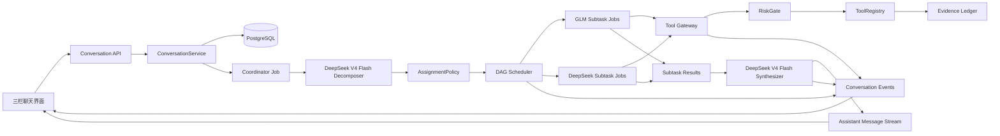

# SecAgent-X 对话式多 Agent 工作流设计规格

- 状态：待书面复核
- 日期：2026-08-26
- 目标：以真正的多轮对话取代一次性任务表单，并引入可恢复、可审计的双模型子任务 DAG
- 实现基线：`origin/lym`（`699893f5`）
- 核心模型：DeepSeek V4 Flash、后台配置的 GLM（默认 `glm-5.2`）

## 1. 已确认决策

本规格固化以下产品决策：

1. 输入方式是持久化的真正多轮对话，不是给原表单套聊天外观。
2. 用户发送消息后，低风险工作自动执行；medium 工具和策略明确允许的已注册 high 工具必须人工审批，forbidden 或超出授权范围的动作始终拒绝。本次改造不新增 high 工具。
3. 在 live/auto 模式下，每个执行轮次的首次模型调用必须由实际路由到的 `deepseek-v4-flash` 完成任务拆解；显式 mock 模式使用带演示标记的确定性模拟。
4. DeepSeek 提议子任务分工，后端能力矩阵负责校验和修正。
5. 子任务构成有向无环图；互不依赖的任务并行，有依赖的任务顺序执行。
6. 同一会话默认最多并行三个子 Agent，管理员可以配置该上限。
7. GLM 和 DeepSeek 子 Agent 都可申请白名单工具；工具不能绕过 ToolRegistry、RiskGate、审批和 Evidence Ledger。
8. 用户在执行过程中追加消息时，系统在安全检查点停止旧计划，保留已完成结果并增量重规划。
9. 模型执行失败后不自动跨模型降级；系统暂停并等待用户决定。
10. 最终答案由 DeepSeek V4 Flash 校验、汇总并流式输出，不再交给 GLM 改写。
11. 输入支持文本、多个文件、项目文件夹和 ZIP。
12. 原授权、安全、目标和资源配置放入高级设置抽屉。
13. 主界面不保留任务模板、场景卡片或快捷提示词，只提供自由输入。
14. 主布局采用左侧会话、中间聊天、右侧任务树的三栏方案；窄屏时右栏收进抽屉。

## 2. 目标与非目标

### 2.1 目标

- 提供类似主流 Agent 产品的会话式输入、历史恢复和连续追问体验。
- 将模型分工变成正式、可持久化、可恢复的运行结构，而不是仅在界面展示模型标签。
- 让 DeepSeek V4 Flash 负责拆解、复杂推理和最终汇总，让 GLM 承担适合其能力的中文材料处理任务。
- 对模型分配、依赖、工具、证据、失败和用户决定形成完整审计链。
- 复用现有 PostgreSQL、Redis/Celery、租约、预算、工具注册表、风险门控、证据账本和认证授权体系。
- 保留现有安全场景的确定性工具能力，但不再要求用户先选择场景模板。

### 2.2 非目标

- 不展示或持久化模型的隐藏思维过程。
- 不允许模型直接执行任意 Shell、网络请求或上传项目代码。
- 不增加第三种大模型。
- 不建设通用 Actor 平台或无限横向扩展的分布式编排系统。
- 不在本次改造中重写现有工具实现、认证体系或安全策略。
- 不自动把失败任务转交另一个模型。

## 3. 代码基线与仓库边界

`origin/lym` 是 `origin/hhj` 的祖先，包含完整后端、前端、Docker、迁移和测试结构，并且没有 `origin/hhj` 新增的可疑根级密钥文件。实现从 `origin/lym` 建立隔离分支。

`origin/hhj` 中的计划、执行、证据和 Markdown 展示组件可以按文件审查后选择性重写或移植；不得直接合并该分支，也不得带入其根级可疑文件和生成产物。

开始功能开发前必须：

- 删除受 Git 跟踪的 `node_modules`、`__pycache__`、`.pytest_cache`、测试数据库和构建产物；
- 补齐对应 `.gitignore`；
- 检查历史之外的工作树中不存在真实 API Key、加密密钥或凭据；
- 在干净源码树上安装依赖并运行基线测试。

## 4. 用户体验

### 4.1 页面结构

桌面端使用三栏布局：

- 左栏：产品标识、新对话、最近会话、会话标题和当前选中状态；
- 中栏：持久化消息流、计划卡、审批卡、失败决策卡、最终答案和固定底部输入框；
- 右栏：当前计划版本的子任务 DAG、模型归属、依赖、状态、进度、工具和结果摘要。

窄屏时：

- 左栏变为会话抽屉；
- 右栏变为任务抽屉；
- 中间聊天和输入框始终是主视图。

新路由以 `/chat/new` 和 `/chat/:conversationId` 为主。旧 `/tasks/new` 重定向到 `/chat/new`。历史任务继续由旧详情页只读访问；新执行轮次同时保留与 TaskRow 的关联。

### 4.2 输入框

输入框支持：

- 多行文字；
- 拖放或选择多个文件；
- 选择项目文件夹并保留相对路径；
- 上传 ZIP；
- 附件预览、移除、大小和上传进度；
- 发送；
- 停止当前执行轮次；
- 打开高级设置抽屉。

高级设置包含：

- 授权范围；
- 安全策略；
- 允许访问的目标；
- 模型路由只读详情；
- 会话级资源限制。

页面不展示任务模板、场景卡片、推荐提示词或模型手动选择卡片。

### 4.3 消息类型

消息流至少支持：

| 类型 | 用途 |
|---|---|
| `user_text` | 用户文字和附件 |
| `assistant_status` | 拆解、排队、运行、重规划等简短状态 |
| `plan` | 结构化任务图及模型分工 |
| `tool_approval` | medium 工具及策略明确允许的已注册 high 工具审批 |
| `model_failure` | 模型失败及用户决策入口 |
| `assistant_answer` | DeepSeek 最终流式答案 |
| `system_notice` | 停止、恢复、预算耗尽和兼容性提示 |

状态消息只展示结论、阶段、分配理由和可操作信息，不输出隐藏思维过程或原始提示词。

### 4.4 执行中追问

用户在当前轮次未结束时发送新消息：

1. 消息立即持久化并显示为“等待接管”；
2. 调度器停止派发新的旧计划子任务；
3. 已运行的模型或工具调用到达安全检查点；
4. 已完成子任务和证据继续有效；
5. 未开始、排队或等待依赖的旧子任务标记为 `superseded`；
6. 新建执行轮次，由 DeepSeek 结合新消息、会话历史、已有结果和证据生成新计划版本；
7. 幂等且输入未变化的已完成工作不重复执行。

## 5. 总体架构



### 5.1 ConversationService

负责会话、消息、附件、执行轮次、停止请求和用户决策。所有改变先持久化，再发布事件。刷新页面或 SSE 重连不得丢失消息。新会话标题默认取首条用户消息清理后的前 40 个字符，并允许用户修改；标题生成不得调用模型，确保 Decompose 始终是该轮首次模型调用。

### 5.2 CoordinatorAgent

CoordinatorAgent 固定调用 DeepSeek V4 Flash 的 `decompose` 阶段。输入包括：

- 当前用户消息；
- 有界会话摘要和最近消息；
- 附件清单、类型、相对路径、哈希和安全扫描摘要；
- 高级设置快照；
- 已完成子任务、证据和未解决问题；
- 可用工具及风险元数据；
- 能力矩阵和预算上限。

输出必须通过 DecompositionDocument Schema 校验。

### 5.3 AssignmentPolicy

AssignmentPolicy 是确定性后端组件。它接收模型建议，不调用模型，并检查：

- 指定 Provider 是否存在且已配置；
- 所需能力是否在 Provider 能力集合中；
- 依赖是否有效；
- 工具是否符合授权与场景安全边界；
- 预算是否允许；
- 分配理由是否是安全、简短、可展示的枚举或模板文本。

模型建议不符合规则时，AssignmentPolicy 可以修正 Provider；修正前后值和原因均写入审计记录。

### 5.4 DAGOrchestrator

DAGOrchestrator 持久化任务图、寻找依赖已满足的子任务并创建子任务 Job。同一会话默认最多三个 `running` 子任务。并发上限由管理员配置，不能由模型扩大。

### 5.5 WorkerAgent

GLM 和 DeepSeek 使用统一 WorkerAgent 协议。每个 Worker 只接收一个子任务及其依赖输出。Worker 可：

- 返回结构化最终结果；
- 申请一个白名单工具调用；
- 基于工具结果继续当前子任务；
- 在预算耗尽或证据不足时返回明确的不完整状态。

每个子任务的模型/工具循环有独立步骤数、模型调用数和时间上限。

### 5.6 DeepSeekSynthesizer

当所有必要子任务进入终态后，Synthesizer 使用 DeepSeek V4 Flash：

- 校验事实引用；
- 处理互相冲突的子任务结果；
- 区分事实、推断和未解决项；
- 生成最终中文回复；
- 以流式增量写入 assistant message。

Synthesizer 不执行新工具。如发现关键证据缺失，它只能请求创建新的计划版本或输出部分结果，不能补造事实。

## 6. 模型能力与路由

### 6.1 能力矩阵

| 能力 | GLM | DeepSeek V4 Flash |
|---|---:|---:|
| 中文语义理解 | 首选 | 支持 |
| 长文档提炼 | 首选 | 支持 |
| 材料分类与字段抽取 | 首选 | 支持 |
| 任务拆解与依赖设计 | 不分配 | 固定 |
| 代码与安全推理 | 支持 | 首选 |
| 逆向与因果链分析 | 不首选 | 首选 |
| 证据冲突判断 | 支持 | 首选 |
| 最终结果汇总 | 不分配 | 固定 |
| 白名单工具申请 | 支持 | 支持 |

能力矩阵以代码常量和测试固定，不从模型输出动态修改。

### 6.2 模型版本

- `decompose` 和 `synthesize` 阶段要求 Provider 为 `deepseek`，实际模型标识为 `deepseek-v4-flash`；
- DeepSeek Worker 默认也使用 `deepseek-v4-flash`；
- GLM Worker 使用管理员当前配置的 GLM 模型，默认 `glm-5.2`；
- ProviderRoute 数据库配置不得静默把 Coordinator 或 Synthesizer 改成其他 DeepSeek 模型；
- live/auto 模式的 Coordinator 和 Synthesizer 不自动回退到 GLM 或 Mock；
- 路由不满足要求时，轮次进入 `waiting_model_decision`，不得假装已使用 V4 Flash；
- 只有显式 `MODEL_MODE=mock` 可使用 MockProvider。Mock 调用记录 `provider=mock`、`emulated_provider=deepseek`、`emulated_model=deepseek-v4-flash` 和 `is_demo=true`，界面与最终答案均显示“演示结果”。

### 6.3 阶段

ModelStage 扩展为：

- `decompose`
- `subtask_execute`
- `synthesize`

两个 Provider 都可处理 `subtask_execute`。仅 DeepSeek V4 Flash 可处理 `decompose` 和 `synthesize`。旧阶段保留用于历史任务兼容，但新会话不再依赖固定的 parse/plan/critic/report 链。

## 7. 结构化契约

### 7.1 DecompositionDocument

```text
DecompositionDocument
  plan_version: integer >= 1
  goal_summary: string
  subtasks: SubtaskSpec[]
  synthesis_requirements: string[]
```

### 7.2 SubtaskSpec

```text
SubtaskSpec
  key: stable string within the turn
  title: concise Chinese title
  objective: bounded objective
  dependency_keys: string[]
  required_capabilities: Capability[]
  proposed_provider: "glm" | "deepseek"
  route_reason_code: RouteReasonCode
  allowed_tools: string[]
  expected_output: string
  required: boolean
```

校验规则：

- key 唯一；
- dependency_keys 必须存在；
- 图必须无环；
- 子任务数不超过配置上限；
- allowed_tools 必须是注册工具和会话授权集合的交集；
- proposed_provider 必须通过能力矩阵；
- route_reason_code 必须来自后端白名单。

### 7.3 SubtaskResult

```text
SubtaskResult
  status: "completed" | "incomplete" | "failed"
  summary: string
  claims: Claim[]
  evidence_refs: string[]
  inference_notes: string[]
  unresolved: string[]
  produced_artifacts: ArtifactRef[]
```

事实性 Claim 必须引用 Evidence ID、附件位置或已验证的上游结果。没有引用的内容只能放入 inference_notes。

## 8. 持久化模型

### 8.1 新表

| 表 | 主要字段 |
|---|---|
| `conversations` | owner、title、status、settings_json、active_turn_id、时间戳 |
| `conversation_messages` | conversation_id、sequence、role、kind、content、status、turn_id |
| `message_attachments` | message_id、受控路径、相对路径、类型、大小、哈希、状态 |
| `conversation_turns` | conversation_id、trigger_message_id、task_id、plan_version、status、预算快照、重规划来源 |
| `subtasks` | turn_id、key、目标、能力、建议/实际 Provider、理由、状态、是否必需、结果摘要 |
| `subtask_dependencies` | subtask_id、dependency_subtask_id |
| `subtask_attempts` | subtask_id、attempt、Provider、model、状态、错误码、租约、开始/结束时间 |
| `subtask_results` | subtask_id、attempt_id、结构化结果、证据引用、产物引用 |
| `model_failures` | turn_id、可空 subtask_id、stage、Provider、model、错误分类、状态、用户决定 |

### 8.2 复用表

- 每个 ConversationTurn 关联一个现有 TaskRow，继续复用任务预算、状态、所有权和审计边界；
- ToolCall、Evidence、Approval 和 ModelCall 增加可空的 `turn_id`、`subtask_id` 或 `attempt_id`；
- JobRun 增加 `job_kind`、`turn_id`、`subtask_id` 和父 Job 引用；
- ConversationEvent 复用现有事件表模式，但以 conversation_id 作为流式查询边界。

所有 JSON 字段在持久化前经过 Pydantic 校验和敏感信息清理。

## 9. 状态机

### 9.1 执行轮次

```text
created
  -> decomposing
  -> scheduling
  -> running
  -> synthesizing
  -> completed
```

非主路径状态：

- `waiting_tool_approval`
- `waiting_model_decision`
- `replan_requested`
- `superseded`
- `partial`
- `failed_retryable`
- `failed`
- `cancelled`

### 9.2 子任务

```text
pending_dependency -> queued -> running -> completed
```

非主路径状态：

- `waiting_tool_approval`
- `waiting_model_decision`
- `incomplete`
- `skipped`
- `superseded`
- `failed`
- `cancelled`

所有状态变更通过仓库层的条件更新完成，并同时追加审计事件。不得由前端直接指定任意状态。

## 10. 队列与并行调度

Job 类型包括：

- `turn_decompose`
- `subtask_execute`
- `turn_synthesize`

Decompose Job 完成后提交任务图。Scheduler 在数据库事务内：

1. 计算依赖已完成的候选子任务；
2. 计算当前会话运行槽位；
3. 最多补齐到并发上限；
4. 为候选创建带唯一幂等键的 Job；
5. 提交后发布到 Celery。

多个 Worker 同时调度时必须通过行锁或唯一约束保证不会重复占用槽位。子任务 Job 使用独立租约和 heartbeat。子任务完成后触发一次轻量调度检查；当所有必需子任务进入终态后，只能创建一个 Synthesize Job。

工具审批只暂停相关子任务；其他不依赖它的已授权子任务可以继续。模型失败会停止派发所有新子任务，正在运行的安全调用到达检查点后暂停。

## 11. 工具与证据

WorkerAgent 不能调用工具实现，只能返回结构化 ToolRequest。Tool Gateway：

1. 校验工具已注册；
2. 校验工具在子任务 allowed_tools 中；
3. 校验参数来源和会话授权范围；
4. 由 RiskGate 计算真实风险；
5. 需要时创建 Approval；
6. 调用 Executor；
7. 把 ToolResult、Evidence 和事件关联到 subtask/attempt。

模型声明的风险等级和批准状态都不可信。low 工具可以自动执行；medium 和策略明确允许的已注册 high 工具必须审批；forbidden、越权或未注册动作直接拒绝。本次改造不注册新的 high 工具。上传项目始终只读处理，不安装依赖、不导入模块、不运行代码。文件夹上传与 ZIP 使用现有文件隔离、路径穿越、符号链接和展开量限制。

## 12. API

### 12.1 会话

| 方法与路径 | 用途 |
|---|---|
| `POST /api/conversations` | 创建空会话，可带高级设置 |
| `GET /api/conversations` | 查询当前用户的会话列表 |
| `GET /api/conversations/{id}` | 获取消息、当前轮次、任务图和状态 |
| `PATCH /api/conversations/{id}` | 修改标题或高级设置；运行中设置只影响下一轮 |
| `DELETE /api/conversations/{id}` | 软删除/归档会话，不物理删除证据 |

### 12.2 消息与执行

| 方法与路径 | 用途 |
|---|---|
| `POST /api/conversations/{id}/messages` | multipart 提交文字、多个附件和相对路径元数据 |
| `POST /api/conversations/{id}/stop` | 请求当前轮次在安全检查点停止 |
| `GET /api/conversations/{id}/events` | SSE，支持 Last-Event-ID |
| `POST /api/model-failures/{id}/decision` | 提交拆解、子任务或汇总阶段的模型失败决策 |
| `POST /api/approvals/{id}/decision` | 提交工具审批决定 |

消息发送必须支持 Idempotency-Key。重复提交返回原消息和执行轮次，不创建第二份附件或 Job。

### 12.3 模型失败决策

每次需要用户处理的失败都会创建 ModelFailure，并在消息卡中引用其 ID。`POST /api/model-failures/{id}/decision` 接受：

- `retry_same`：同一 Provider 创建新 attempt；
- `reassign`：仅适用于子任务；指定另一 Provider，经 AssignmentPolicy 校验后创建 attempt；
- `skip_and_replan`：仅适用于子任务；标记跳过并让 Coordinator 重规划依赖任务；
- `terminate_turn`：停止本轮并基于已有结果生成部分回答；如果拆解尚未成功，则只生成系统终止消息。

Decompose 和 Synthesize 固定属于 DeepSeek V4 Flash，不能通过 `reassign` 转给 GLM。系统不得自动提交任何失败决策。

## 13. 实时事件

至少包含：

- `conversation.message.created`
- `turn.decomposition.started`
- `turn.decomposition.completed`
- `turn.plan.versioned`
- `subtask.assigned`
- `subtask.queued`
- `subtask.started`
- `subtask.progress`
- `subtask.tool.requested`
- `subtask.waiting_approval`
- `subtask.failed`
- `subtask.waiting_model_decision`
- `subtask.completed`
- `model.failure.waiting_decision`
- `model.failure.resolved`
- `turn.replan.requested`
- `turn.synthesis.started`
- `assistant.answer.delta`
- `assistant.answer.completed`
- `turn.completed`

每个事件具有单调递增 ID、conversation_id、turn_id、可选 subtask_id 和经过脱敏的 payload。前端以事件 ID 去重；重连时从最后确认 ID 继续。

## 14. 失败与恢复

### 14.1 模型失败

Provider 客户端可以对传输级超时或限流进行一次低层重试。仍失败时：

- 子任务进入 `waiting_model_decision`；
- 轮次停止派发新任务；
- 前端展示错误分类、模型、子任务和四种决策；
- 不展示原始响应、密钥或隐藏推理；
- 用户决定前不得跨模型继续。

### 14.2 Worker 或服务重启

- 过期租约由现有 JobRecovery 机制回收；
- 已保存的 DecompositionDocument 不重新生成；
- 已完成子任务不重新调用模型；
- attempt 幂等键防止同一逻辑尝试重复入账；
- 工具调用沿用现有幂等语义；
- Synthesize Job 通过唯一约束只创建一次；
- 未完成的流式 assistant message 从已保存的最后增量恢复或重新生成一个明确的新 attempt。

### 14.3 依赖失败

- 必需依赖失败时，下游保持 `pending_dependency`；
- 用户选择 `skip_and_replan` 后，由新计划版本决定替代依赖；
- 用户选择终止时，独立已完成结果进入部分回答；
- 不把被跳过或失败的结果标为成功。

## 15. 预算与配置

新增配置项：

- `MAX_PARALLEL_SUBTASKS_PER_CONVERSATION=3`
- `MAX_SUBTASKS_PER_TURN=12`
- `MAX_MODEL_CALLS_PER_SUBTASK=4`
- `MAX_TOOL_CALLS_PER_SUBTASK=6`
- `SUBTASK_TIMEOUT_SECONDS=180`
- `MAX_REPLANS_PER_TURN=2`
- `MAX_CONVERSATION_CONTEXT_TOKENS=32000`
- `MAX_ATTACHMENTS_PER_MESSAGE=20`
- `MAX_ATTACHMENT_TOTAL_BYTES=209715200`

所有上限由服务器控制，前端只展示有效值。管理员可以降低上限；提高上限仍受全局任务 Token、步骤和时限预算约束。

## 16. 前端组件边界

建议组件：

- `ConversationSidebar`
- `ChatWorkspace`
- `MessageList`
- `ChatComposer`
- `AttachmentTray`
- `AdvancedSettingsDrawer`
- `PlanMessageCard`
- `AgentTaskTree`
- `SubtaskDetailPanel`
- `ToolApprovalMessage`
- `ModelFailureMessage`
- `StreamingAnswerMessage`

Pinia 状态按会话归一化保存 messages、turns、subtasks 和事件游标。乐观用户消息使用 client_message_id 与服务端消息合并。任务树只消费真实 Subtask 数据，不从 ModelCall 或日志推测 Agent。

可复用 `origin/hhj` 的展示思想包括计划卡、当前执行、证据、运行日志、Markdown 和审批；移植时必须适配新会话/子任务契约并重新写测试。

## 17. 兼容与迁移

- 新表通过 Alembic 增量迁移创建；
- 现有 TaskRow 不强制回填 Conversation；
- 旧任务 API 保留只读与既有生命周期行为，直到单独废弃；
- 新聊天创建的每个 Turn 关联一个 TaskRow；
- `/tasks/new` 重定向至 `/chat/new`；
- 旧任务列表可以在左侧会话区之外提供“历史任务”入口；
- MockProvider 增加 Decompose、Subtask 和 Synthesize 三类确定性响应，只在显式 mock 模式支持无 Key 演示；不得在 live/auto 会话中伪装成真实 DeepSeek。

## 18. 安全与隐私

- API Key 和加密密钥不得进入消息、事件、模型输入摘要、日志或报告；
- 原始 Prompt 和原始模型响应不写入前端可见事件；
- route_reason 使用受控代码和安全模板；
- 会话、消息、附件、子任务和事件全部执行现有所有权/RBAC 检查；
- 文件名、相对路径和压缩包条目需要规范化与长度限制；
- 文件夹和 ZIP 内容只读，不执行；
- Web 工具继续执行 SSRF、重定向和授权主机校验；
- 停止或重规划不能绕过正在进行的审计记录；
- 最终答案中的事实必须可追踪，模型推断必须显式标注。

## 19. 测试策略

### 19.1 后端单元测试

- DecompositionDocument Schema；
- 唯一 key、缺失依赖和环检测；
- 能力矩阵接受与修正；
- 首次调用及最终调用的实际 DeepSeek 模型校验；
- DAG ready 集合和并发槽位；
- 状态机非法跳转；
- 四种模型失败决策；
- SubtaskResult 引用规则；
- 上下文、预算和敏感信息清理。

### 19.2 后端集成测试

- 创建会话、发送多附件消息和恢复历史；
- Coordinator 创建任务图并持久化模型分配；
- 三个并行子任务与依赖解锁；
- GLM/DeepSeek Worker 申请工具且 RiskGate 生效；
- 工具审批只阻塞相关子任务；
- 模型失败停止新调度并等待用户；
- 执行中追问生成新计划版本；
- 租约过期恢复、Job 幂等和唯一 Synthesize Job；
- SSE Last-Event-ID 和事件去重；
- DeepSeek 最终回答引用证据并标记部分失败。

### 19.3 前端测试

- 三栏布局和移动抽屉；
- 自由输入且不存在模板卡；
- 多附件与文件夹相对路径；
- 高级设置抽屉；
- 乐观消息与刷新恢复；
- 任务树依赖、模型、理由和状态；
- SSE 重连；
- 审批卡、模型失败卡、停止；
- 执行中追问与计划版本；
- 最终答案流式增量和证据跳转。

### 19.4 端到端测试

Mock 双模型流程：

1. 创建空会话；
2. 上传项目文件夹；
3. 输入“分析这个项目并找出高风险问题”；
4. 确认第一条 ModelCall 为 `provider=mock`、`emulated_model=deepseek-v4-flash`、`stage=decompose` 且 `is_demo=true`；
5. 展示 GLM 与 DeepSeek 的任务图；
6. 三个子任务并行，第四个等待依赖；
7. 触发一次工具审批；
8. 触发一次模型失败并等待用户选择；
9. 恢复后由 DeepSeek 流式输出带引用的最终答案；
10. 发送追问并生成第二版计划；
11. 刷新页面和重启 Worker 后恢复。

## 20. 验收标准

1. 首页是自由输入的三栏聊天工作区，没有任务模板。
2. 同一会话支持多轮消息、多个附件和项目文件夹。
3. 刷新后消息、任务图、进度和最终答案完整恢复。
4. live/auto 模式每个轮次首次模型调用实际为 `deepseek-v4-flash` 的拆解阶段；显式 mock 模式记录等价的模拟路由并显著标记演示。
5. 每个子任务展示建议模型、实际模型和受控分配理由。
6. 无依赖子任务并行且同一会话运行数不超过 3。
7. GLM 与 DeepSeek 的工具申请都经过统一安全链。
8. 模型失败不会自动换模型，并能通过四种用户决策恢复。
9. 执行中追问复用已完成结果并产生新计划版本。
10. 最终答案只由 DeepSeek V4 Flash 生成，并区分事实、推断和未完成范围。
11. Worker 重启和 SSE 重连不会重复执行或重复显示。
12. 后端测试覆盖率不低于 85%。
13. 前端测试、类型检查和生产构建通过。
14. Mock 双模型端到端验收通过。
15. Secret 扫描无真实凭据，上传项目从不被执行。

## 21. 实施边界

实现按以下纵向切片推进：

1. 仓库清理与干净基线；
2. 会话、消息、附件和 SSE；
3. DeepSeek 拆解契约与能力分配；
4. 持久化子任务 DAG 和并行 Job；
5. 双模型 Worker、工具网关和证据；
6. 失败决策、执行中追问和恢复；
7. DeepSeek 流式汇总；
8. 三栏聊天前端；
9. 兼容、迁移、端到端和发布门槛。

每个切片必须使用测试先行、可独立验证并保持现有安全回归通过。本规格不授权删除历史任务、强制替换远程 main、提交真实凭据或扩大攻击性工具范围。
